# Camera Trap Sorting and Scoring Protocol

University of Arizona

Updated September 14, 2022

## Purpose

This goal of this document is to explicitly detail the methods used in
the sorting and scoring of camera trap photos used in the study of wild
horse/elk/cattle interactions. See definitions for *sorting* and
*scoring*. Additionally, this document aims to increase repeatability
and reduce subjectivity when scoring camera trap photos. *Repeatability*
ensures that different people can use this methodology to produce the
same results for each photo. Scoring camera trap photos inherently
involves some subjectivity i.e., personal judgement when scoring dark,
blurry, or obscured photos. By following the best practices outlined
below, researchers scoring camera trap photos can reduce subjectivity to
an absolute minimum.

### Important Definitions

**Photo Sorting**: the process by which researchers look through the
file folders of camera trap photos and copy the photos with subjects
(e.g., horses, elk, cattle, humans, deer etc) into new file folders. The
goal of sorting is to reduce the amount of time spent scoring photos
without subjects, which increases the efficiency of the photo scoring.
Note: photos without subjects are still important data and should *not*
be deleted from the photo database.

**Photo Scoring**: the process by which researchers examine camera
trap photos and translate the things they see in the photo to a
spreadsheet (e.g., Excel), which can later be used for analysis. The
goal of scoring is to generate *useful* data that can be analyzed
through statistical means. Note: Emphasis is placed on useful data, as
researchers must pre-define a set of criteria to be extracted from
camera trap photos (e.g., species, number of individuals, group size,
behaviors) based on *a priori* hypotheses or predicted patterns.
Extraneous (*not useful*) data is often collected which slows down photo
scoring and is a waste of time. Researchers must make a careful
consideration of what criteria to score before photo scoring occurs (and
ideally at the beginning of the study).

**Subject**: species or thing of interest (as defined by the photo scoring
criteria) that are visible in the photo, including: horse, cow, elk,
mule deer, turkey, pronghorn, coyote, wolf, grey fox, mountain lion,
bobcat, bear, cottontail, jackrabbit, skunk, raccoon, human, dog,
horseback, ATV, UTV, Truck/SUV, and other.

**Time Lapse Camera**: a camera trap that takes photos at a specified
time interval: 1 photo/5min for sites in White Mountains, and 1 photo/5min for
sites in Heber, Arizona and New Mexico. Time lapse cameras have motion-activated settings
set to 1 motion-activated photo per hour (motion settings cannot be
disabled outright).

**Trail Camera**: a camera trap that takes photos *only* when its
passive infrared motion sensor is activated, typically by an animal
walking by, but sometimes from grass blowing in the wind or other
sources. Time delays between photos (sometimes called quiet periods) can
be set in the camera's settings. For this study, a 3 second delay was
set between photos to reduce empty photos.

**SD card**: also known as SDHC (high capacity), removable storage
chip that is inserted into camera trap and photos are stored on the SD
card in the camera

### While in the Field

1.Navigate to the desired camera trap location. Coordinates and maps
for each of the cameras can be found in the Appendix. Remove the
camera from the case by unlocking the Python cable lock using the
small key labeled P182 or P399. Key P182 unlocks cameras in New
Mexico, whereas key P399 unlocks cameras in Arizona. *Watch out for
spiders and other stinging insects, especially Black Widows, that
may have made their home inside the security case.*

2.Open the camera and slide the switch from the 'On' position to the
'Setup' position (see below image for a reference). If the camera is
dead, the LCD screen will fail to display text. Sometimes there is a
delay between switching the camera from the 'On' position to 'Setup'
position up to 10 seconds in some cases. If the LCD screen fails to
illuminate, replace the batteries with new AA lithium batteries
(avoid alkaline).


### Settings for Time-lapse Camera Traps
**Mode**: Camera
**Image Format**: Widescreen (Bushnell E3 N/A)
**Image Size**: HD Pixel
**Capture Number**: 1
**Interval**: 60 minutes
**Sensor Level**: Low
**Camera Mode**: 24 hrs
**Timestamp**: On
**LED Control**: High (Bushnell E3 N/A)
**NV Shutter**: Auto (Bushnell E3 N/A)
**Field Scan**: On
	**A**: 00:00 to 12:00
	**B**: 12:01 to 23:59
	**Interval**: 1 min for Boggy and Wildcat, 5 min for all other sites

### Settings for Motion Camera Traps
**Mode**: Camera
**Image Format**: Widescreen (Bushnell E3 models N/A)
**Image Size**: 3M
**Capture Number**: 1
**Interval**: 3 seconds
**Sensor Level**: Low
**Camera Mode**: 24 hrs
**Timestamp**: On
**LED Control**: High (Bushnell E3 models N/A)
**NV Shutter**: Auto or High (Bushnell E3 models N/A)
**Field Scan**: Off

>[!Note] 
>Bushnell Essential E3 camera traps do not have some
>settings compared to the Bushnell Tropy or NatureView models. These
> settings have been marked as ‘(Bushnell E3 models N/A)'.

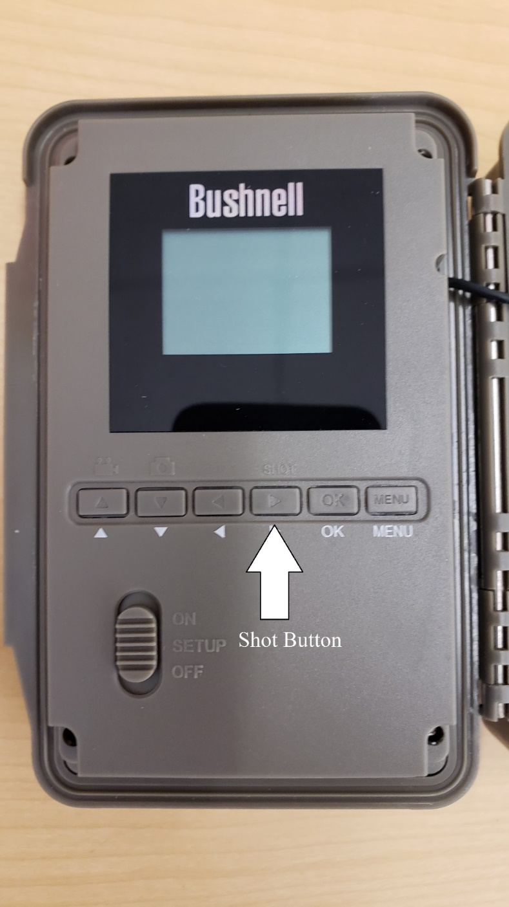


3. Fill out a Camera Trap Test Photo datasheet found in the Appendix
with the date, time, lat/long, site code, and site name. Using the
'Shot' button on the camera trap, set the clipboard down on the
ground and take a few photos of the Camera Trap Test Photo datasheet
to embed a photo with the relevant metadata inside the photo folder
on the SD card. This will help the photos be better documented for
future use. See the below image for an example of camera trap that
has taken a picture of the Camera Trap Test Photo datasheet.

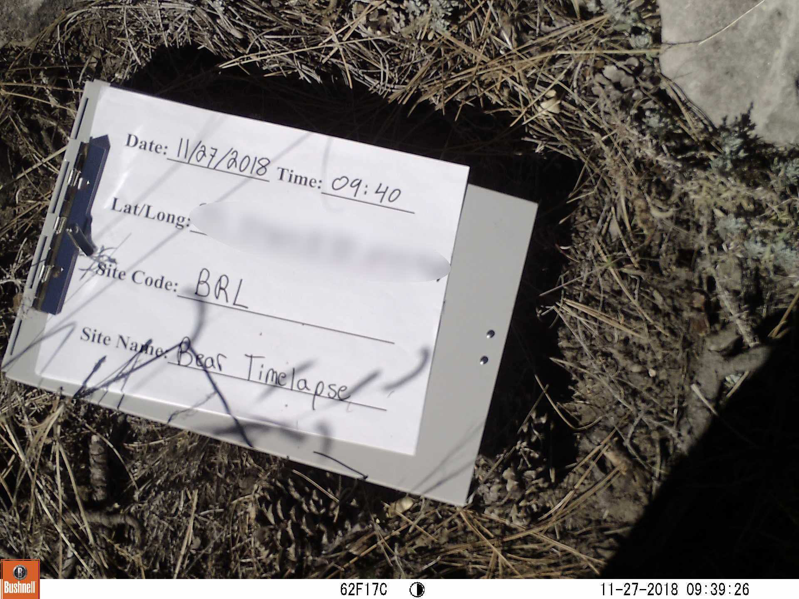

4. Record the camera metadata using the Camera Trap Maintenance Visit
datasheet found in the Appendix. This datasheet documents the number
of photos and other relevant camera settings that are important. Pay
special attention to the time and date difference between camera's
clock and the actual time (from your watch or GPS). See the image
below for an example of a completed Camera Trap Maintenance Visit
datasheet. *Note: some of the fields have N/As because some Bushnell
models have those settings and other models (e.g., Bushnell
Essenstial E3) don't have those settings.*


5. Remove the SD card from the camera and put it in the black zippered
SD card case.

6. Put a blank SD card in the camera and new batteries, if required.
Flip the Camera Trap Maintenance Visit datasheet over to the side
labeled Camera Trap Visit Checklist. Use this checklist to ensure
you don't make any mistakes and the camera is properly set to
collect more photos, unless you are removing the camera from the
field. See the below image for an example of a completed Camera Trap
Visit Checklist.

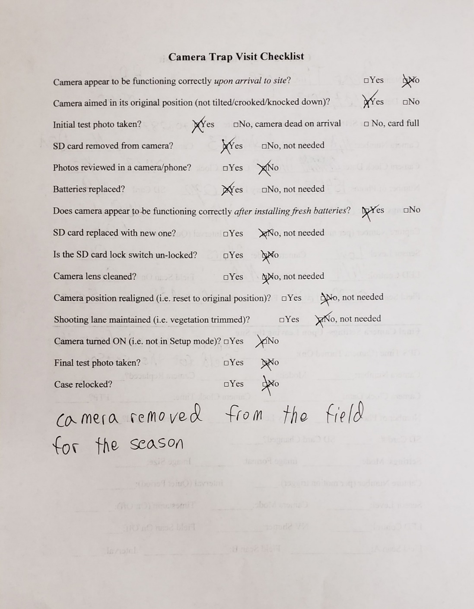

## Data Management

### Downloading Camera Trap SD Cards Procedure

7. Insert the SD card into the SD card reader

8. Copy (do not Move or Cut/Paste) the "DCIM" folder from the SD card
into a temporary folder on your desktop. This preserves the original
folder on the SD card if you make a mistake.

9. Rename the "DCIM" folder that was copied to desktop by double
clicking on the folder name, and then using the following scheme:
three-letter site code, the date of the first photo captured, and
the date of the last photo captured (e.g., WCS_07302019_09182019)

10. Install the Bulk Rename Command Line tool
https://www.bulkrenameutility.co.uk/ to rename each photo by the
time and date it was captured. You may need to download this program
if you haven't already.

a. The following command will rename photos by their date and will append a number if the date and time is the same as another file which is what the `/NODUP` flag does.

b. Change the name of the folder in the script (`andre\temp` below) to the name of the folder that you copied to a temporary folder on your desktop.

c. Copy and paste this edited line into Windows Powershell or Command
Prompt and press enter. Your window should scroll by fast if the
script was executed correctly. If there is an error in the script
(e.g., incorrect folder name) the renaming script will not work and
will not show any output in the window. 

```PowerShell
C:\Program` Files\BRC64\BRC64.exe /DIR:"C:\Users\andre\temp" /NOFOLDERS /RECURSIVE /PATTERN:"*.JPG" /REMOVENAME /APPENDDATE:M:P::-:10:"%Y-%m-%d-%H-%M-%S" /NODUP /EXECUTE
```

11. Run the `01-extract-image-paths.R` script on the renamed parent
folder (e.g., WCS_07302019_09182019). This may take a few minutes
depending on the number of photos in the parent folder.

12. Check that the R script has finished running and has created a new
csv file in the parent folder and the the csv file matches the name
of the parent folder (e.g., WCS_07302019_09182019.csv). This csv
creates a table of all the photos in each folder, so we have an
inventory of all photos.

13. Copy and paste the folder onto a 4 Tb external hard drive in the
correct folder location (e.g., root directory à cameratraps à
wildcat à timelapsesouth).

14. Copy and paste the folder onto a second 4 Tb external hard drive in
the correct folder location (e.g., root directory à cameras à
wildcat à timelapsesouth).

15. Upload a copy to Cyverse in the correct folder location, similar
path as above.

## Processing Data

### Sorting Photos 

See the [Camera Trap Sorting and Scoring Protocol](Camera%20Trap%20Sorting%20and%20Scoring%20Protocol.md) protocol for
more details. This section provides a brief overview of the process.

16. ***Tag*** ***Photos with Subjects*** Photos with subjects are
temporarily *tagged* in IrFanView. (see the "Photo Tagging and
Sorting Using IrFanView.pdf" protocol).

17. ***Record Subjects Metadata*** The file names of tagged photos are
also *recorded* as a text file to keep track of which files have
subjects (see the "Photo Tagging and Sorting Using IrFanView.pdf"
protocol).

18. **Repeat this process for all of subfolders** (e.g., 100EK113)
within a collection folder (e.g. WCN_04252018_05122018).

### Scoring Photos


19. Open the .xlsm file in Microsoft Excel. You should see a spreadsheet
with 8 columns by however many photos were in the "subjects" folder
you extracted the metadata from<sup>1</sup>. See screenshot below. <sup>1</sup>Note:
some photos may have been removed from the .csv file because they
had file sizes of 0. You will get a security warning about enabling macros. 

>[!Important]
>You must enable macros for this spreadsheet to work properly. See screenshot below.

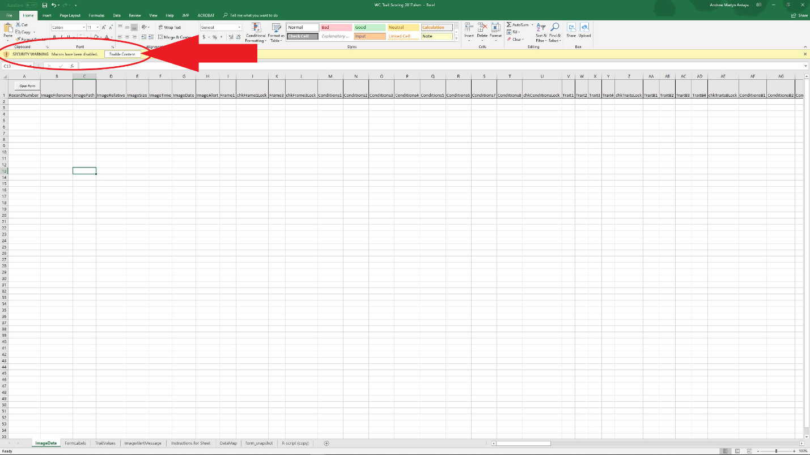

22. Navigate to the "ImageData" sheet on the lower left corner of the
spreadsheet (See screenshot below). 

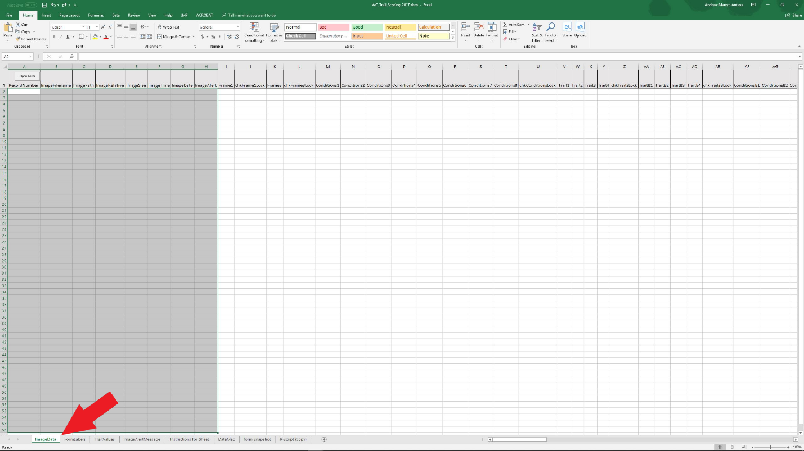

24. You should get a .xlsm file that looks like this (see screenshot below).


25. Click on the button “Open Form” to launch the Scoring Macro (a graphical interface written in Visual Basic for Applications (VBA)) (See screenshot below).

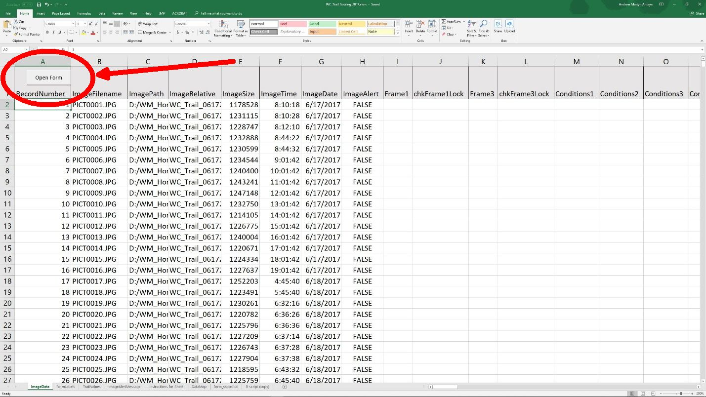

#### Resizing the Macro Window to Fit Your Screen

27. You most likely will need to change your computer's display settings to
be able to see the entire window that pops up when you clicked "Open
Form". This is a problem related to the macro itself, and the solution
presented here is a represents a temporary fix.


As you can see, the macro is partially cut-off and doesn't fit my
screen.

28. To fix this, go to your desktop and right click on a blank space on your
desktop. A menu (screenshot below) will open. Click on the option that
says "Display settings".

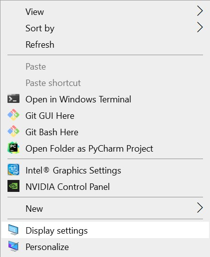

The "Display" settings window will open. Scroll down until you see the
"Scale and layout" option (screenshow below).

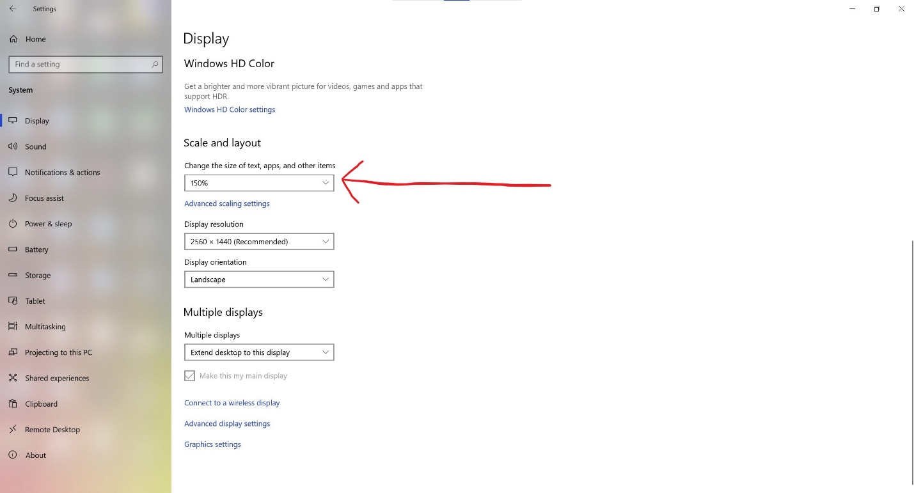

Under the "Change the size of text, apps, and other items" choose a
smaller scaling percentage that fits the window that pops up from the
Excel form. On my computer, 125% scaling makes the pop-up window fit my
screen. You may need to choose 100% scaling depending on your screen's
resolution.


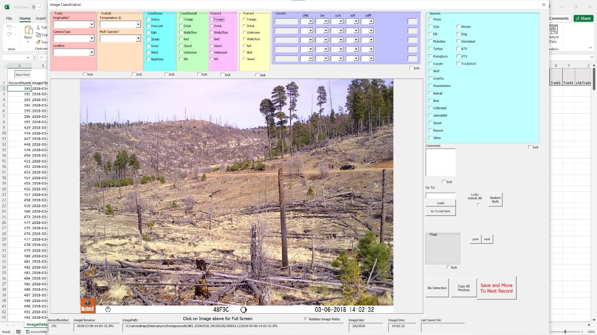

By changing the display scaling, the window now fits on my screen
(barely). I had to hide the task bar so I could see the information
displayed along the bottom of the macro window.

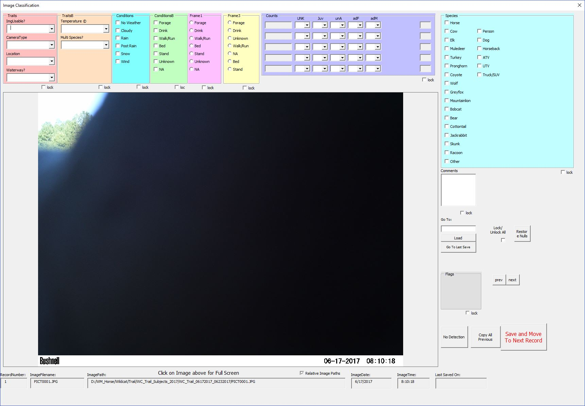

29. The Photo Scoring Form runs on the Excel macro that was programmed
into this spreadsheet using Visual Basic for Applications (VBA). The
macro auto-fills in the spreadsheet rows with attributes that you
select in the colored boxes. This allows researchers to collect a
multitude of variables in a spreadsheet form that is easily analyzed
statistically.

30. We are interested only in the areas delineated in these reference
photos, specifically the riparian areas (or in the case of Wills
Canyon and Rio Penasco, two upland areas as well). The reference
photos in the Appendix delineate which areas to score and which
areas to exclude from scoring. These reference photos will help
ensure repeatability and consistency between human observers.


31. The Photo Scoring Form does not store the photos inside the form,
rather it uses file paths to find each photo and load the photo into
the photo viewer (see screenshots below). **Important:** If the
image path is changed, such as when you rename a folder, the photos
may not load into the photo viewer because the Photo Scoring Form
does not look in the right place on the hard drive for the photo.
It's like if you moved to a new house, now the Post Office doesn't
know where to deliver your mail, so you have to update your address.
Try to minimize folder name changes to prevent this problem from
occurring.


32. The Photo View shows each photo from the "Subjects" folder from
which you extracted metadata. It loads these photos using file paths
detailed in Step 28.

33. The first set of attributes to score is in the red "Traits" box (see screenshot below) which offer a series of drop-down choices for the
person scoring the photo to select.

a. The first dropdown box in the red "Traits" box asks if the image
is *useable*- is this photo completely obscured by darkness,
something standing too close or covering the lens (e.g., cows
often stand right against the camera).

a. If the image is obscured for some reason then select "No" in
the dropdown box. The below screenshot is an example of an
image that was not *useable*, there for it was scored "No".

b. If the image is not obscured, then select "Yes" in the
dropdown box to indicate that the image is *useable*.

c. Select "NA" in the dropdown box if you're not sure if the
image is useable or if there is a general error.


b. The second dropdown box in the red "Traits" box asks you the *camera
type*-

a. select "Motion" in the dropdown box if the photos you are
scoring came from a trail camera (see definitions).

b. Select "Time-lapse" in the dropdown box if the photos you are
scoring came from a time lapse camera (see definitions).

c. Select "NA" in the dropdown box [only] if there is
an error.

c. The third dropdown box in the red "Traits" box asks you the
*location* (i.e. site name) of the camera. Select the correct camera
location for the photos you are scoring. Try using the scroll bar in
dropdown box if you don't see the correct camera location. Locations are only included in each xlsm macro if those locations are relevant to the respective project. In other words, locations from the White Mountains project are not included in the Heber project xlsm macro.

White Mountains Project (may not be complete list)
>NA
>BoggyEast
>BoggyWest
>BoggyTrail
>WidcatN (spelled incorrectly in the dropdown box)
>WidcatS (spelled incorrectly in the dropdown box)
>WildcatTrail
>EastFork

Heber Project (may not be complete list)
>BearTL
>BearTrail
>BearField
>BlackCanTL
>BlackCanTrail
>BigField
>Highway

d. The fourth and final dropdown box in the red "Traits" box asks you
if animals are in the *Waterway*- the *Waterway* is defined as the
width of the water plus a 2m strip of land on either side (near side
or far side from the camera's perspective) of the stream extending
for the length of the stream in the photo. Determining this can be
subjective, therefore review the below screenshots to help determine
if animals are in the *Waterway*. The below screenshot is an example
of a horse in the *Waterway.*

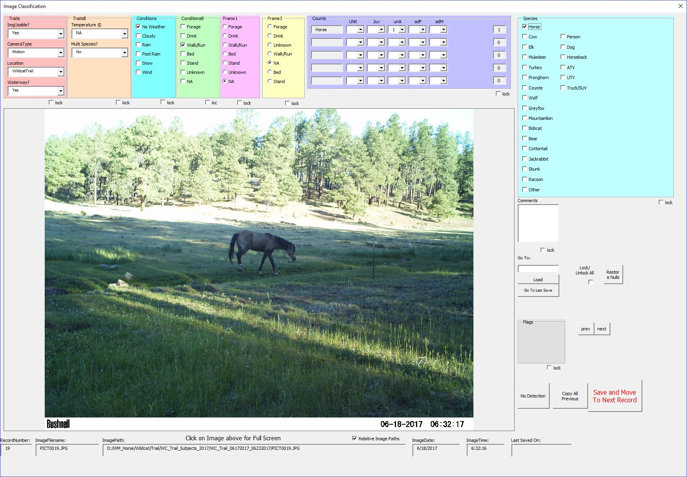

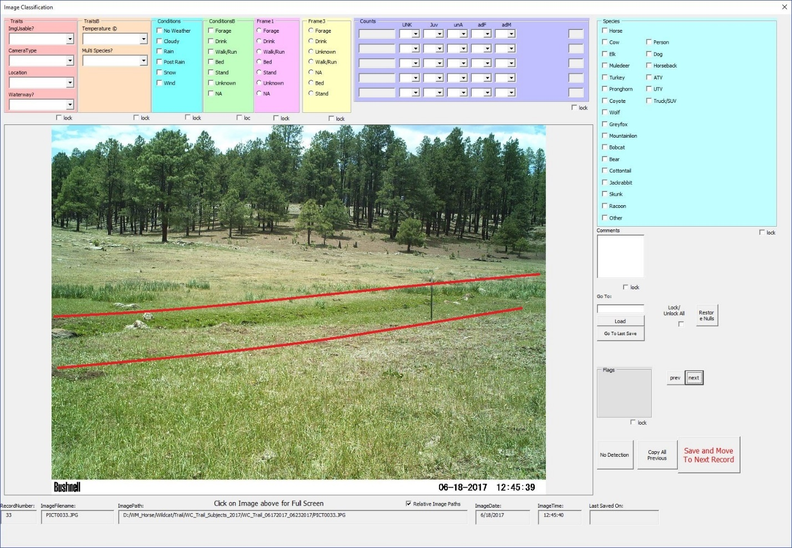

e. The above screenshot has two red lines drawn onto the image to
roughly indicate the +/- 2m strip of land along the *Waterway*.

a. If animals are within this strip, then you should select "Yes"
in the *Waterway* dropdown box within the red "Traits" box.

b. If animals are not within this strip, then you should select
"No" in the *Waterway* dropdown box within the red "Traits" box.

c. Select "NA" in the *Waterway* dropdown box only if there are no
animals in the photo.

34. The next set of attributes to score are in the light orange
"TraitsB" box (see screenshot below) which has two dropdown boxes
that require selections by the person scoring the photo.

a. The first dropdown box in light-orange "TraitsB" box is the
*Temperature* attribute. Some camera traps have built-in
temperature sensors which will display the temperature at the
time the photo was taken. The temperature (if the camera is
equipped) will be displayed on the bottom center of the photo
near the timestamp.

a. If the photo does not have temperature information, select
"NA" in the *Temperature* dropdown box.

b. If the photo does have temperature information, then select
the nearest numerical value (in °C) in the *Temperature*
dropdown box. Numerical values are: \<-20, -20, -10, 0, 5,
10, 15, 20, 25, 30, 35, 40, 45, \>45

b. The second dropdown box in light-orange "TraitsB" box is the
*Multi Species* attribute which asks if there are multiple
species visible in the photo.

a. If the photo only has one species visible (such as the deer
in the below screenshot), then select "No" in the *Multi
Species* dropdown box.

b. If the photo has more than one species visible (e.g., cows
and horses, elk/horses/cows), then select "Yes" in the
*Multi Species* dropdown box.

c. If the photo does not have any species visible in the photo,
> then select "NA" in the *Multi Species* dropdown box.


33. The next set of attributes to score are in the teal "Conditions" box
(see below screenshot). The teal "Conditions" box is a checkbox
format which allows the observer to select multiple attributes if
they apply to the photo. The teal "Conditions" box ask you what
weather is observed in the photo and allow you to select one or more
of the following attributes:

a. Select "No Weather" if the photo is sunny or otherwise no
observable weather is visible in the photo.

b. Select "Cloudy" if the photo is overcast.

c. Select "Rain" if rain is visible in the photo.

d. Do not select "Post Rain"- this weather condition is too
subjective and will be removed from the Photo Sorting Form.

e. Select "Snow" if snow is visible falling to the ground in the
photo or if snow is visible on the ground in the photo.

f. Select "Wind" if dust devils or other indicators of strong winds
are visible in the photo. Do not select "Wind" if you think its
just a gentle breeze.

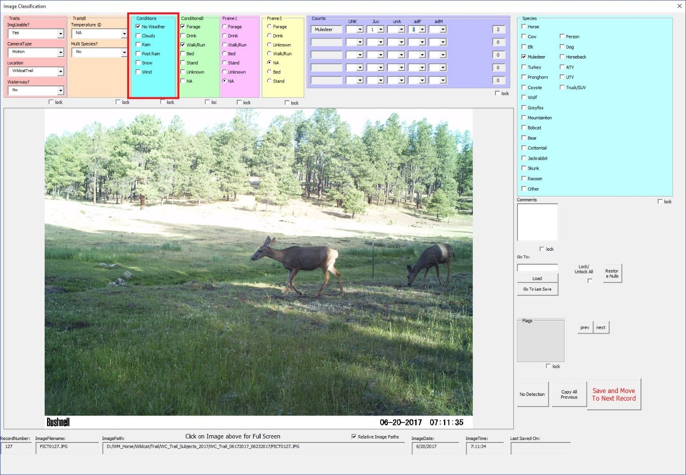

34. The next attribute to score is the light green "ConditionsB" box
(see below screenshot). The light green "ConditionsB" is also a
checkbox format allowing the person scoring the photo to select one
or more attributes if they apply to the photo. The light green
"ConditionsB" box asks: what are the behaviors of each individual
for the primary species. Primary species is defined as the species
that has \>=50% of animals visible in photo in the case of Multi
Species photos.

a. Select "Forage" if one or more individuals of the primary
species have their head to the ground and perceived to be
consuming grass (or other plants).

b. Select "Drink" if one or more individuals of the primary species
have their head in the water and perceived to be drinking from
the water.

c. Select "Walk/Run" if the one or more individuals of the primary
species are perceived to be walking. A good indicator of walking
or running is when an individual's legs are not even with each
other (such as when you take a stride while walking).

d. Select "Bed" if one or more individuals of the primary species
are bedded down (when an animals lies on the ground, usually
with it's legs tucked under its body if it's a quadruped).

e. Select "Stand" if one ore more individuals of the primary
species are standing. A good indicator of standing is when an
individual's legs are together and on the ground.

f. Select "Unknown" if the behavior of one or more individuals of
the primary species cannot be observed in the photo, such as
when an individual's head is not visible in the photo.

g. Select "NA" on if no animals are visible in the photo.

a. In the screenshot below there are two mule deer, each induvial
is displaying a different behavior so this photo was scored as
two behaviors in the light green "ConditionsB" box. The deer on
the left has its head about parallel with its body and looks
like it is walking. The deer on the right has its head down
towards to ground and looks like it is foraging. **Note**: a
single individual can display more than one behavior, such as
standing and foraging. You can make multiple selections for the
same individual.


35. The next attribute to score is the pink "Frame1" box (see screenshot
below). The "Frame1" box is a single selection box that lets the
person scoring the photo select only one attribute. This may be
changed in future iterations of the Photo Scoring Spreadsheet.

36. The pink "Frame1" box asks: what is most frequently observed
behavior for all individuals visible of the secondary species. The
selectable behaviors are the same as in Step 33.

a. Secondary species is defined as the species that has \<50% of
all animals visible in photo in the case of Multi Species
photos.

a. Example: This situation may arise when there are many cows
in the photo and a few horses. In this example, the cow is
the primary species and all of the behaviors visible for
cows should be selected in the light green "ConditionsB"
box. The horses in this example are considered the secondary
species. The most frequently observed behavior for all of
the horses visible in the photo should be selected in the
light pink "Frame1" box.

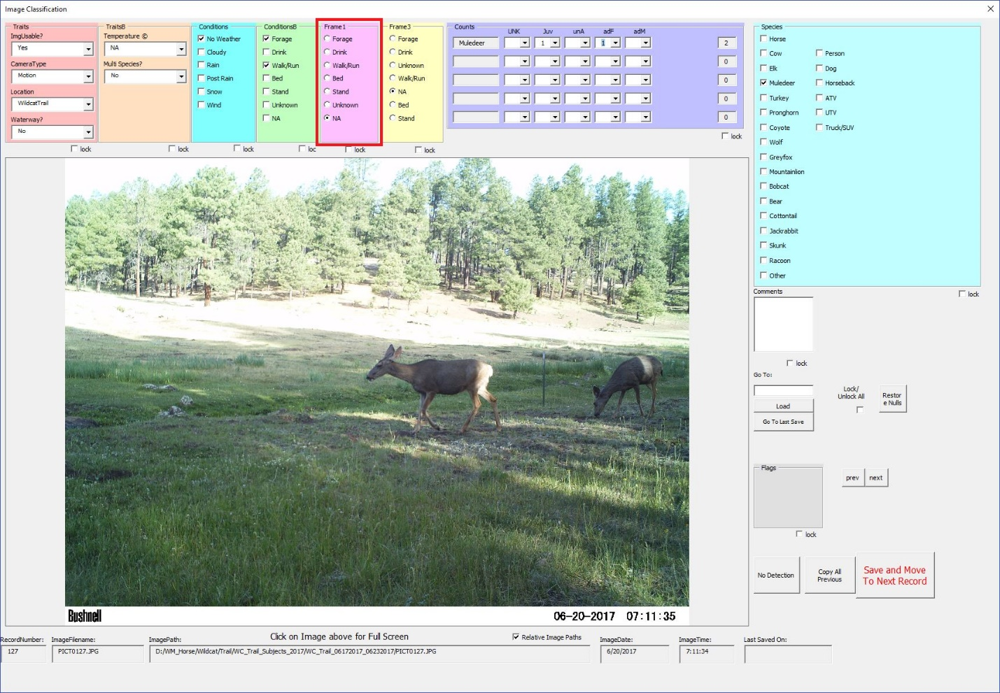

37. The next attribute to score is the yellow "Frame3" box (see below
screenshot). Similar to the light pink "Frame1" box, the yellow
"Frame3" box is a single selection attribute.

a. The yellow "Frame3" box asks: What is the most frequently
observed behavior for all individuals visible of the tertiary
species. The selectable behaviors are the same as in Step 33,
however they are in a different order. This will likely be
changed in future iterations of the Photo Scoring Form.

a. The tertiary species is defined as the species that has the
fewest individuals visible in the photo in the case of Multi
Species photos.


38. Before we score the purple "Counts" box, we must first make one or
more selections for light blue "Species" checkbox. The purple
"Counts" box is only enabled when selections are made in the light
blue "Species" checkbox (see screenshot below).

a. Select each box in the light blue "Species" box for each species
visible in the photo.

a. Identifying species can be tricky sometimes if the photo is
dark or blurry, or if only a body part of the animal is
visible in the photo. If you are unsure which species is in
a photo, flag the photo for further review (see Best
Practices). This functionally will be incorporated into
future iterations of the Photo Scoring Form.

1. Coyotes are sometimes hard to distinguish from gray
foxes or wolves, especially at night. If you are unsure,
flag the photo.

2. The "Other" selection can be used for species not listed
in the "Species" checkbox.

3. Some knowledge of common animal species is required for
quality photo scoring.

b. In the below screenshot, only mule deer are visible,
therefore only the "Muledeer" selection was checked in the
light blue "Species" checkbox.

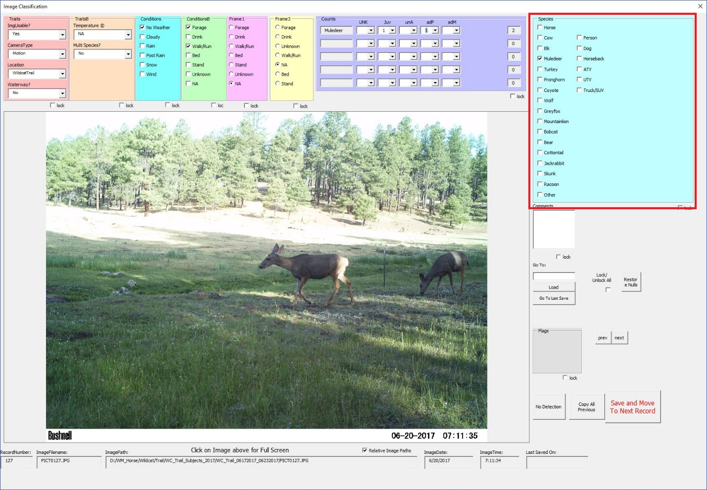

39. After we make one or more selections in the light blue "Species"
box, the species we selected will appear in the purple "Counts" box
(see screenshot below). The "Counts" box asks: how many individuals
for each species selected are visible in the photo, and what are
their age and sex classes (if age and sex class can be determined
visually). Some knowledge of common species is required for quality
photo scoring.

a. The "UNK" (unknown) dropdown box should be selected when age
class and sex cannot be reliably determined, but the number of
individuals of that species can be determined. Selectable values
range from 0 to 20.

b. The "Juv" (juvenile) dropdown box should be selected when you
can reliably determine age class for a number of individuals of
that species. Selectable values range from 0 to 20.

a. e.g., Spots on a deer fawn, a foal (juvenile horse) stands
next to an adult horse and the foal is clearly much smaller
than an adult horse

c. The "unA" (unknown adult) dropdown box should be selected when
you can reliably determine that a number of individuals are
adults but cannot reliably determine if those adult animals are
male or female. Selectable values range from 0 to 20.

a. e.g., horses can be difficult if you cannot see sex organs
in the photo, therefore it is safer to select a number of
"unA" than to guess at the number of adult males or females

d. The "adF" (adult female) dropdown box should be selected when
you can reliably determine that a number of individuals are
adult females of that species. Selectable values range from 0 to
20.

e. The "adM" (adult male) dropdown box should be selected when you
can reliably determine that a number of individuals are adult
males of that species. Selectable values range from 0 to 20.

a. e.g., during the summer and fall, adult male elk and deer
have antlers or 'horns'

f. Repeat this process of counting number of individuals for each
species and dividing them into age and sex classes for all
species visible in the photo (in the case of a Multi Species
photo).

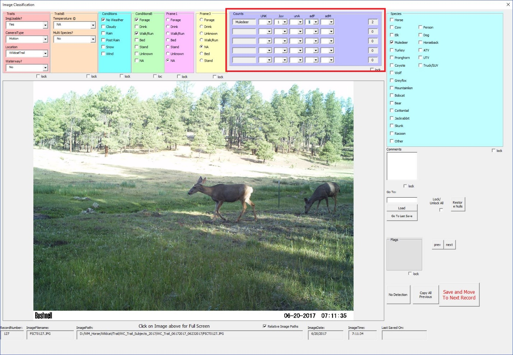

40. In the above screenshot, there is one adult female deer (doe) at the
center of photo and one juvenile deer (fawn) on the right side of
the photo. At this time of the year (June 20) you would expect an
adult male deer (buck) to have antlers, even if they are still in
velvet. You can look at the size difference between the adult doe
and fawn to determine age class. Also, the head to ear proportions
on juvenile animals are usually different than adult animals. After
scoring many photos, you will become better as correctly classifying
age and sex.

41. You can add comments to a photo using the "Comments" box. A useful
comment might be "Is this a fox or a coyote?" or "Person in this
photo was checking the camera".


42. The "Restore Nulls" box in the below screenshot will reset all the
attributes to their default settings and [erase] all the
attributes you selected. You can use "Restore Nulls" to quickly
reset the selections made on a photo.


43. The "lock" check boxes found at the bottom of each box remembers the
values you selected for each box when you go to the next picture.
The "lock" feature is a valuable time-saving feature that you can
use to have the form remember commonly selected attributes.

a. Example: All of the photos you are scoring are from the Wildcat
Trail camera, which is a motion activated camera. By selecting
the "lock" checkbox underneath the red "Traits" box, the form
will remember you selected those attributes when you go to the
next photo.

b. The "Lock/Unlock All" checkbox (see in the below screenshot with
a star next to it) can unlock or lock all the boxes without
having to manually click each checkbox.


44. If you do not detect an animal in the photo, make the selections for
each attribute similar to the selections made in the screenshot
below, then click the "No Detection" button to autofill the purple
"Counts" table with zeros. You must click "No Detection" button
before the Photo Scoring Form will allow you to go to the next
photo.


45. **Important**: The last thing you ***[must]*** before
scoring the next photo is to click the red "Save and Move To Next
Record" button. This button will save all of the selections you made
in all of the colored boxes. If you do not hit this button, all of
the selections you made for that photo will be lost!

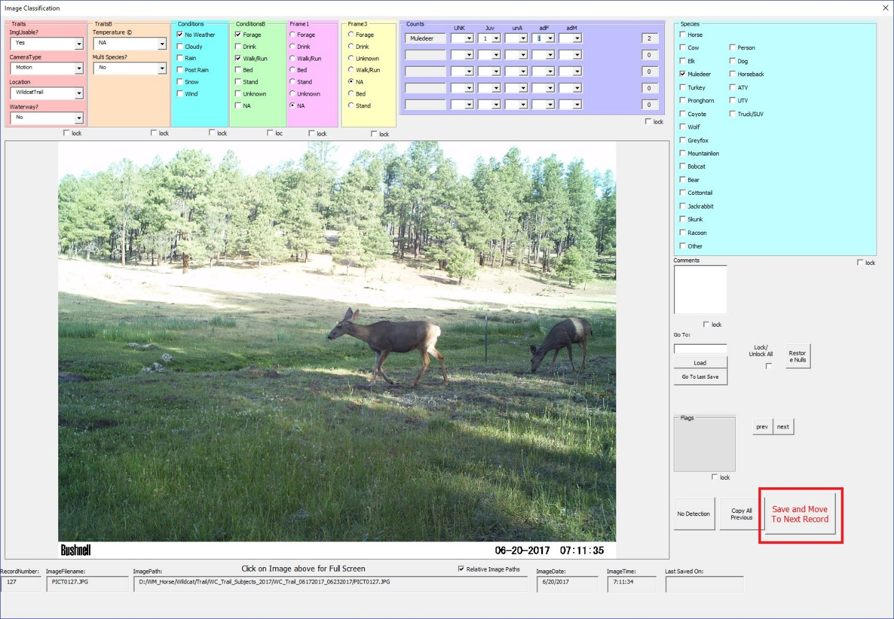

46. After you have saved and moved to the next photo, you may find that
many of the attributes you selected have not changed from one photo
to the next. You can use the "Copy all Previous" button (see
screenshot below) to quickly copy all of the selections you made on
the previous photo to your current photo. Be sure to change
attribute selections if something does change between photos.

a. In the next photo after the doe and fawn, only a single deer is
visible and you cant reliably determine if it's an adult or
juvenile. You can use "Copy all Previous" to copy the attribute
selections you made on the last photo and then just change the
values in the "Counts" box.

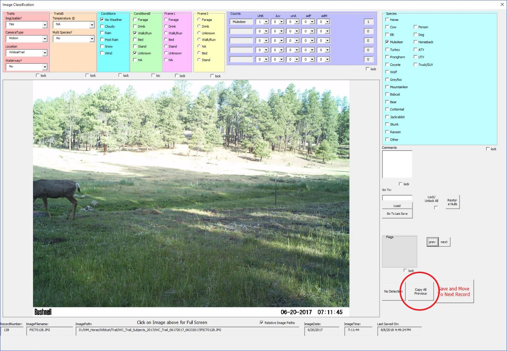

47. Repeat this process for all of the photos you are scoring.

## Appendix 1
### Table of Camera Trap Names
| **Camera Name**     | **Sitecode** | **Folder Naming Convention**<sup>1</sup> |
| ----------------------- | ------------ | ---------------------------------------- |
| FiftyOne                | A51          | A51_MMDDYYYY_MMDDDYYYY                   |
| Agua Chiquita Barbed    | ACB          | ACB_MMDDYYYY_MMDDYYYY                    |
| Agua Chiquita Electric  | ACE          | ACE_MMDDYYYY_MMDDYYYY                    |
| Agua Chiquita Exclosure | ACX          | ACX_MMDDYYYY_MMDDYYYY                    |
| Agua Chiquita Homestead | ACH          | ACH_MMDDYYYY_MMDDYYYY                    |
| Agua Chiquita Upland    | ACU          | ACU_MMDDYYYY_MMDDYYYY                    |
| Bear Timelaspe          | BRL          | BRL_MMDDYYYY_MMDDYYYY                    |
| Bear Trail              | BRT          | BRT_MMDDYYYY_MMDDYYYY                    |
| Bigfield                | BFD          | BFD_MMDDYYYY_MMDDYYYY                    |
| Black Canyon Dam        | BKD          | BKD_MMDDYYYY_MMDDYYYY                    |
| Black Canyon North      | BKN          | BKN_MMDDYYYY_MMDDYYYY                    |
| Black Canyon South      | BKS          | BKS_MMDDYYYY_MMDDYYYY                    |
| Black Canyon Trail      | BKT          | BKT_MMDDYYYY_MMDDYYYY                    |
| Boggy East              | BGE          | BGE_MMDDYYYY_MMDDYYYY                    |
| Boggy Trail             | BGT          | BGT_MMDDYYYY_MMDDYYYY                    |
| Boggy West              | BGW          | BGW_MMDDYYYY_MMDDYYYY                    |
| Boggy West 5 Min        | BGW_5min     | BGW_5min_MMDDYYYY_MMDDYYYY               |
| Highway                 | HWY          | HWY_MMDDYYYY_MMDDYYYY                    |
| James Canyon            | JCY          | JCY_MMDDYYYY_MMDDYYYY                    |
| Rip Penasco Riparian    | RPR          | RPR_MMDDYYYY_MMDDYYYY                    |
| Upper Wills Canyon      | UWL          | UWL_MMDDYYYY_MMDDYYYY                    |
| Wildcat Exclosure       | WCX          | WCX_MMDDYYYY_MMDDYYYY                    |
| Wildcat North           | WCN          | WCN_MMDDYYYY_MMDDYYYY                    |
| Wildcat South           | WCS          | WCS_MMDDYYYY_MMDDYYYY                    |
| Wildcat South 5 Min     | WCS_5min     | WCS_5min_MMDDYYYY_MMDDYYYY               |
| Wildcat Trail           | WCT          | WCT_MMDDYYYY_MMDDYYYY                    |
| Wills Canyon Riparian   | WLR          | WLR_MMDDYYYY_MMDDYYYY                    |
| Wills Canyon Upland     | WLU          | WLU_MMDDYYYY_MMDDYYYY                    |
|                         |              |                                          |

<sup>1</sup> this naming convention refers to the date of the first photo on the SD card in the 100EK113 folder, and the date of the last photo in last
1xxEK113 sub-folder on the SD card. If there is date error, use the
corrected date for this naming convention, but be sure to make note of
the date corrections in the camera trap metadata standard text file.

## Appendix 2
### Camera Trap Test Photo Metadata Sheet
[Camera Trap Metadata and Checklist Data Sheet v1.4](../datasheets/Camera%20Trap%20Metadata%20and%20Checklist%20Data%20Sheet%20v1.4.pdf)

### Camera Trap Maintenance Visit Metadata Sheet
[Camera Trap Test Photo Data Sheet v1.2](../datasheets/Camera%20Trap%20Test%20Photo%20Data%20Sheet%20v1.2.pdf)

## Appendix 3

### Sorting and Scoring Best Practices

***Difficult to Identify Subjects***

Sometimes a photo contains a subject that is difficult to identify, such
as barely visible eyes of an animal reflect the infrared camera flash, a
dirty lens, or only a body part of an animal is in the photo. During the
photo sorting phase, still copy the photo with the difficult to identify
subject into the folder "Subjects" folder (see Step 7 above). It's safer
to include the photo in the "Subjects" folder than to not include the
photo. Researchers can examine the photo closely during the Photo
Scoring phase to determine if the photo contains a subject.

***Flagging Photos for Further Review***

If you are unsure what species is in the photo, flag the photo so
another researcher or supervisor can review the photo and come to a
conclusion to exclude the photo from analysis if the subject is too
obscured for a reliable identification, or to include the photo in
analysis if the researchers are confident with a reasonable degree of
certainty they can identify the subject in a photo.

Take-Away Message: If you are unsure of the subject of a photo, flag it
for further review.

***File Management***

It is safer to use copy/paste than by clicking and dragging (i.e.
moving) photos from one place to another. When you move photos, they are
no longer in their original location or sometimes not in their original
order. Mistakes happen, especially during repetitive tasks like photo
sorting. If you always have the original files stored somewhere safe,
then you can always refer back to those original files if something goes
wrong.
