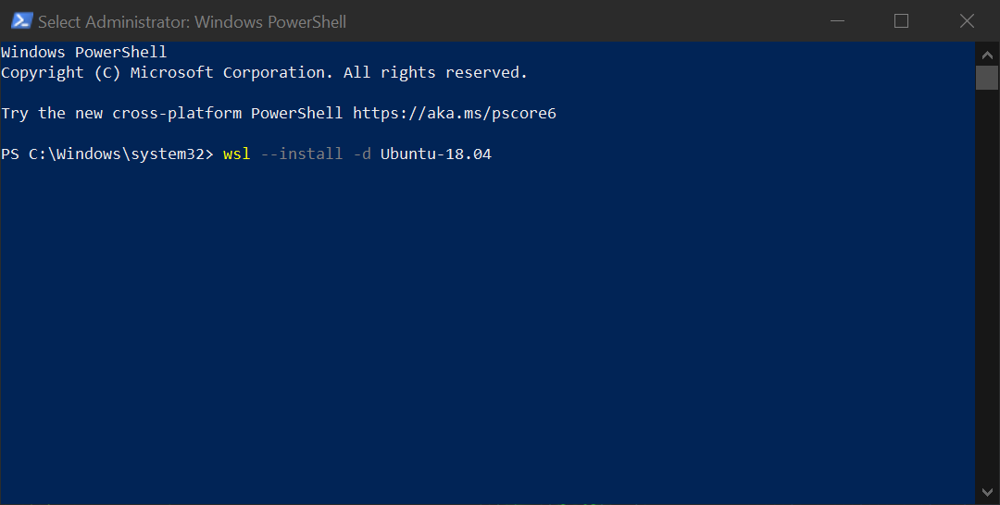

# How to Share Analysis with Docker Containers
Created: 2022-09-08 10:08:49

A common problem when trying to reproduce analysis are the intervening changes in the underlying software dependencies that run the analysis code. Changes in software dependencies such as your operating system (e.g., Windows 10, MacOS) and the R packages themselves used in your analysis (e.g., dplyr, lubridate) can cause analyses to fail or produce different results. Docker containers gives scientists the ability to share their exact analysis code and software dependencies with other scientists making research and collaboration more reproducible, potentially many years later (more on that later).


Credit: http://www.quickmeme.com/p/3vuukg/page/5

To get started, you first need to install the software to run the Docker containers, for many scientists, this is Docker Desktop [(Download Link)](https://www.docker.com/products/docker-desktop/) Docker Desktop runs containers using your local computer’s resources (memory, storage, and processor). Docker can also be run on servers for larger analysis and collaboration. Projects such as [Cyverse](https://cyverse.org/) run Docker containers (called “Apps” on Cyverse) and as well as host data on their file system.

To run Docker containers locally, for Windows 10 or 11 users, you will first need to install Windows Subsystem for Linux (WSL). The WSL runs a Linux kernel inside of a virtual machine on your local computer. Docker requires the WSL to run on Windows computers. Follow the [Installation Instructions](https://docs.microsoft.com/en-us/windows/wsl/install). I would recommend installing Ubuntu 18.04 or 20.04 as your Linux distribution. 

Run this in a PowerShell (Administrator) terminal to install Ubuntu-18.04.
```PowerShell
wsl --install -d Ubuntu-18.04
```

Or

Run this in a PowerShell (Administrator) terminal to install Ubuntu-20.04
```PowerShell
wsl --install -d Ubuntu-20.04
```

Your PowerShell terminal should look like this:




## Downloading the Code

### Fork the Repo

The analysis code used in this project is hosted on GitHub [here](https://github.com/amantaya/grazing-interaction). This GitHub repository (repo) contains the scripts used to analyze data and produce figures. Since you don’t have permission to write to this repository directly, you can create a copy of the code called a ‘fork’ in git terminology. A fork allows you to modify the code from this repo and track those changes under version control. Follow these [instructions](https://docs.github.com/en/get-started/quickstart/fork-a-repo) to fork this repo. *Forks are created under your GitHub account*.

### Clone the Repo

After you’ve created a fork, you need to download a copy of the code to your computer, in git terminology this is called a ‘clone’. To create a copy of this run the below code in a terminal/shell on your computer, replacing ‘YOUR-USERNAME’ with your GitHub username. Make a note of where this folder is located on your computer.

>[!NOTE]
>You need to have git installed on your computer to run the following command. Download git [here](https://git-scm.com/downloads)

```shell
git clone https://github.com/YOUR-USERNAME/grazing-interaction
```

## Running the Container
After you’ve installed WSL and Docker Desktop, you can run Docker containers on your local machine. To run a container for this project, you can run this PowerShell script which has the [[scripts/utilities/docker-run-commands.ps1]] necessary commands to launch the Docker container. 

Copy and paste the below commands into a shell/terminal, and change the location of `C:/Users/andre/Dropbox/Dev/grazing-interaction` to the location of the cloned repo on your computer (i.e. the folder containing the analysis code). Leave the `:/home/rstudio/grazing-interaction` on the right side of the colon unchanged. This is the location of the files _inside_ of the Docker container.

This command will first download the Docker container built for this project `amantaya/rocker-verse:4.0.5` which has all of the required R packages and dependencies already installed inside of the Docker container. It will then mount the analysis code that your forked onto the container. Finally, it will run the container in Docker Desktop.

>[!Important]
> Only run the following Docker commands on your local computer because it is unsecure. Authentication is disabled and the user runs as root (to install packages inside of a running container, if needed).

```PowerShell
docker run -d -e DISABLE_AUTH=true -e ROOT=TRUE --rm -p 127.0.0.1:8787:8787 `
-v C:/Users/andre/Dropbox/Dev/grazing-interaction:/home/rstudio/grazing-interaction `
amantaya/rocker-verse:4.0.5
```

This is code from [scripts/utilities/docker-run-commands.ps1](https://github.com/amantaya/grazing-interaction/blob/main/scripts/utilities/docker-run-commands.ps1)

If successful, you will see something similar (the numbers correspond to the container id and will be different on your machine):


Next, open Docker Desktop. Under “Containers”, go to image labeled `amantaya/rocker-verse:4.0.5`. The name of your container will be different.

Then under Container “Actions”, click “Open with Browser”.


If successful, you should see R Studio running in your browser!


## Tags
#tutorial #docker #wsl 

## References
1. 